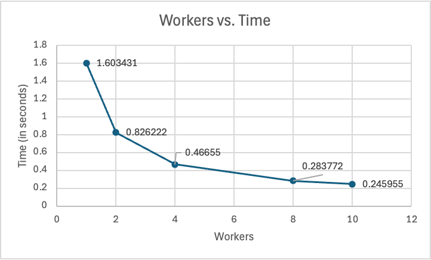

# Parallelizing the Mandelbrot Set
## Introduction
The Mandelbrot set comprises of numbers $c$ for which the iterative series $z_{n+1}=z_n^2+c$ remains limited when initiated from $z_0=0$. To be more specific, a complex number c is part of the Mandelbrot set if the series does not veer off towards infinity as n approaches infinity.

The steps involved in calculating the Mandelbrot set are:
1. Grid Creation
 - First a grid of numbers is established by defining a range, for both the imaginary parts of $c$.
2. Iterating
 - For each point $c$ in the grid a sequence is started with $z_0=0$. Then iterated using the formula $z_{n+1}=z_n^2+c$ for a set number of iterations (e.g., 1000).
3. Bound Checking
 - After the iterations if the magnitude of zn exceeds a threshold (typically 2) it indicates divergence and the points color is determined based on how many iterations it took to diverge. Points that stay within bounds are colored black indicating they are part of the Mandelbrot set.
4. Visualization
 - The assigned colors are used to generate a representation of the Mandelbrot set showcasing patterns that highlight its fractal nature.

The Mandelbrot set holds significance in various fields, including computer graphics, chaos theory, and mathematics. It illustrates how simple repetitive actions can lead to complex and sophisticated patterns. 

Parallelizing the Mandelbrot set involves understanding different methods and addressing challenges such as load imbalance. Efficient parallelization is crucial for improving performance and reducing computation time in the evaluation.

## Implementation
To efficiently evaluate the Mandelbrot set, through parallelization, Message Passing Interface (MPI) and OpenMP were used. The combination of the two leverages the benefits that come from their implementation of the master-worker paradigms, maximizing the performance. 

### MPI
The computation by MPI is done through the master-worker paradigm, where the master node manages the distribution of work across multiple worker nodes. The master node is responsible for initializing the parameters and distributing work of specific chunk sizes to the workers, to be processed. Each worker node, then independently processes their assigned chunks applying the Mandelbrot set formula, $z_{n+1}=z_n^2+c$, iteratively. 

### OpenMP
Within each worker node, OpenMP is used to further parallelize the process. By applying OpenMP, the workload for each worker node is divided upon its multiple threads. 

This allows for the appropriate application of the multi-core processors:
```c
double* times = (double*)malloc(threads*sizeof(double));
#pragma omp parallel num_threads(threads)
{
   double tstart, tend, telapsed;
   int tid = omp_get_thread_num();
   tstart = omp_get_wtime();

   #pragma omp for schedule(dynamic) nowait
   for (int i = start; i < end; i++) {
       for (int j = 0; j < nx; j++) {
           int index = i * nx + j;
           double x0 = xStart + (1.0 * j / nx) * (xEnd - xStart);
           double y0 = yStart + (1.0 * i / ny) * (yEnd - yStart);
           double x = 0, y = 0;
           int iter = 0;

           while (iter < maxIter) {
               double temp = x * x - y * y + x0;
               y = 2 * x * y + y0;
               x = temp;
               iter++;
               if (x * x + y * y > 4) {
                   break;
               }
           }
           matrix[index] = iter;
       }
   }
   tend = omp_get_wtime();

   telapsed = tend - tstart;
   times[tid] = telapsed;

}
```

#### Parallelization
- The use of OpenMP with `#pragma omp parallel num_threads(threads)` allows for parallel execution of the Mandelbrot set calculation across multiple threads.

#### Grid Iteration
- The outer loop iterates over rows indexed by `i` (representing the imaginary part), and the inner loop iterates over the columns indexed by `j` (representing the real part).
- For each point in the complex plane, it computes the corresponding $c$ value from `x0` and `y0`, which are derived from `xStart`, `xEnd`, `yStart`, and `yEnd`.

#### Mandelbrot Iteration
- The initialization of `x` and `y` to 0 corresponds to the iteration with z0=0.
- The while loop implements the iteration zn+1=zn2+c. The updates for `x` and `y` follow the mathematical definition, with `temp` used to hold the squared real part.
- The condition `if (x * x + y * y > 4)` checks for divergence, consistent with the definition that if the magnitude exceeds 2 (or 4 in squared terms), the point is considered to have diverged.

#### Storing Results
- The `matrix[index] = iter;` statement stores the number of iterations it took each point to either diverge or reach the maximum iteration count of 255,  which can be used for coloring when visualizing the Mandelbrot set.

#### Timing
- The code measures the execution time for each thread using `omp_get_wtime()`, which provides valuable insights on workload scheduling.
- By utilizing `schedule(dynamic)`, the workload is dynamically distributed among threads, allowing them to take on new tasks as they complete their current ones.
- This approach improves load balancing and resource usage, leading to reduced wait time and faster execution.
- Figures 1 and 2 compare execution times with and without `schedule(dynamic)`, demonstrating the differences and benefits.

<p align="center">
    
    
</p>
<p align="center">Figures 1 and 2. Non-Dynamic vs Dynamic Scheduling</p>

The integration of MPI and OpenMP provides an efficient and effective solution for parallelizing the Mandelbrot set. MPI excels in managing communication between nodes and coordinating the distribution of workloads, ensuring that tasks are allocated appropriately across the system. In contrast, OpenMP enhances performance within each node by leveraging its multiple threads to execute computations concurrently. This complementary use of MPI for node to node communication and OpenMP for thread parallelism enables efficient handling of large workloads while significantly reducing execution time.

## Results and Discussion
As previously mentioned, load imbalance becomes a problem when parallelizing. Load imbalance occurs when the workload is evenly distributed among workers but results in inefficient execution due to variations in the complexity of the task and/or execution speed.

### Load Imbalance
- Ideally, each worker should have an equal share of the total task to maximize efficiency and minimize wait time.
- In the context of the Mandelbrot set, the initial idea was to evenly distribute the work between each worker.
 - The aim was to create a balanced workload, however, this leads to that load imbalance problem, as more often than not, some chunks do end up containing more complex points to compute than the others.

<p align="center">
    
</p>
<p align="center">Figure 3. Time Spent by Each Worker</p>

### Testing Chunk Sizes
To properly address this problem, determining the impact of chunk sizes on performance is important. Therefore, the Mandelbrot set is computed on varying chunk sizes. The execution times for each chunk size are then recorded and graphed to reveal the overall performance, as seen in Figure 4.

<p align="center">
    
</p>
<p align="center">Figure 4. Chunk Size Time Comparison</p>

From this initial testing, the two lowest execution times were at chunk sizes of 40 and 400. For a more optimal chunk size, 200, a random number between the two, was selected. This resulted in Figure 5 that provides the extra result. 

<p align="center">
    
</p>
<p align="center">Figure 5. Optimal Chunk Size Time</p>

### Load Balance
After determining the optimal chunk size through the testing process, the next step is to use the size to assess the load balance. By timing the execution with the selected chunk size, Figure 6 is created to illustrate the load balance achieved over the workers.

<p align="center">
    
</p>
<p align="center">Figure 6. Time Spent by Each Worker with Optimal Chunk</p>

### Benefits of Parallelization
The increase in workers leads to a significant reduction in execution time, demonstrating the benefits of MPI, in particular, and parallelization in enhancing performance and efficiency. By distributing workload through the master-worker paradigm, tasks can be processed simultaneously, maximizing resource usage and minimizing wait time. This approach not only accelerates computation, but also shows the scalability of parallelizing, as adding more workers continues to improve overall performance, even if there is an increase in workload.

<p align="center">
    
</p>
<p align="center">Figure 7. Time for More Workers</p>

### The Mandelbrot Set
After parallelization, the results showcasing the actual Mandelbrot set can be obtained. The generated image illustrates the intricate patterns that result from the iterative process. The visualization also reveals the reason why the Mandelbrot set is known for its aesthetic appeal and fractal structure, serving as an example of the intersection between math and art.

<p align="center">
    
</p>
<p align="center">Figure 8. Mandelbrot Set Visual</p>

# Conclusion
Parallelizing the computation of the Mandelbrot set allows for the improvement of performance and efficiency. By leveraging different paradigms, OpenMP and MPI, allowed for the effective distribution of workload across multiple nodes and threads, reducing execution time, and maximizing the resources available. 

The process involves creating a grid of complex numbers, iterating through them, and checking for divergence. Addressing the challenge of load imbalance is crucial, as the variations of work complexity can lead to inefficiencies and inactivity. Through careful analysis of various chunk sizes and dynamic workload distribution, a balanced workload for each worker can be achieved. 

The implementation of MPI and OpenMP resulted in significant performance gains, with optimal chunk sizes enhancing load balancing and reducing execution time. These findings emphasize the effectiveness of parallel computing in tackling complex mathematical computations.
